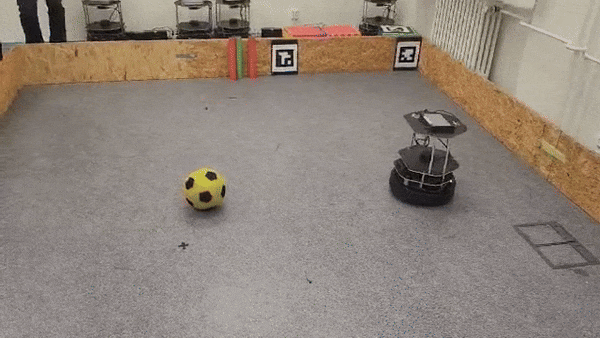

# ⚽ LAR_Messi - Autonomous TurtleBot Soccer Player
*Precision Robotic Football System*

  
*Real-time demonstration of the autonomous scoring system*

## 🏆 System Overview
An autonomous robotic platform that enables TurtleBot to play soccer through:

- **Computer Vision** - Real-time ball and goal detection
- **Path Planning** - Optimal scoring trajectory calculation
- **Precision Control** - Velocity-regulated movement system
- **Decision Making** - 12-state finite state machine

**Technology Stack**:  
   
        
     


## 🗂️ Project Structure
LAR_Messi/    
├── docs/    
│ ├── _build/ # view auto-generated html documentation. "index.html"  
│ ├── media/ # Demo video      
│ └── conf.py # Documentation configuration        
├── src/       
│ ├── main.py # Primary control system      
│ ├── motor_driver.py # Robot movement control       
│ ├── image_processor.py # Vision pipeline      
│ ├── scene_info.py # Detection data structure        
│ ├── search_engine.py # Scene analysis       
│ ├── visualizer.py # Debug visualization        
│ ├── hsv_filter.py # Color detection      
│ └── path_info.py # Navigation data       
└── requirements.txt # Dependency list         


## 📚 Documentation
[Sphinx auto-generated documentation](https://papouc.github.io/LAR_Messi/)
## 💻 Installation

### Clone repository:
```bash
git clone https://github.com/Papouc/LAR_Messi
cd LAR_Messi
```

### Install dependencies
```bash
pip install -r requirements.txt
```
### Run program
```bash
python src/main.py
```

## 📊 System Architecture

------Dodelava David

## ✅ Code Quality

### Run PEP8 check
```bash
flake8 src/
```
### Expected output:
```bash
0 errors found
```


## 👥 Team Members  
Adam Hendrych,
David Horňáček,
Adam Hejtmánek

📅 Last Updated: {05.04.2025}
🏷️ Version: {1.0.0}
